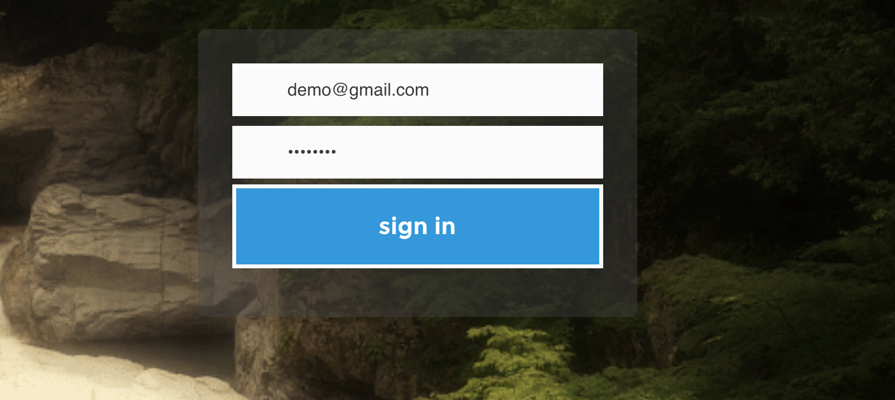
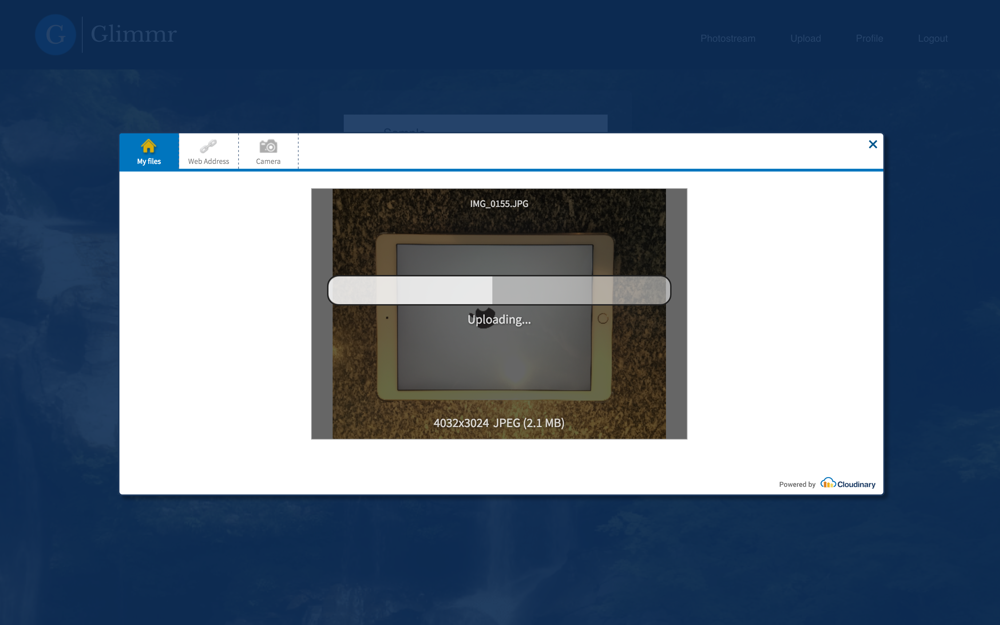
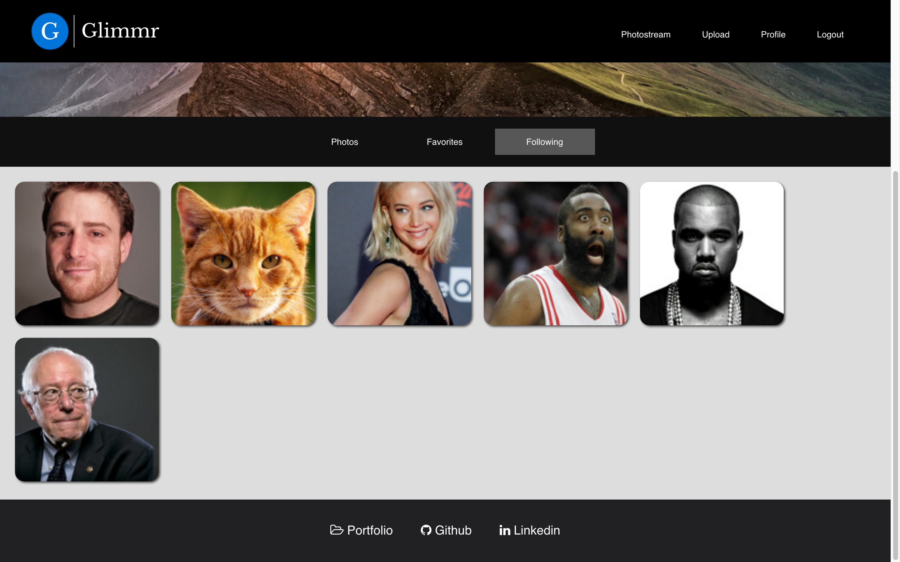
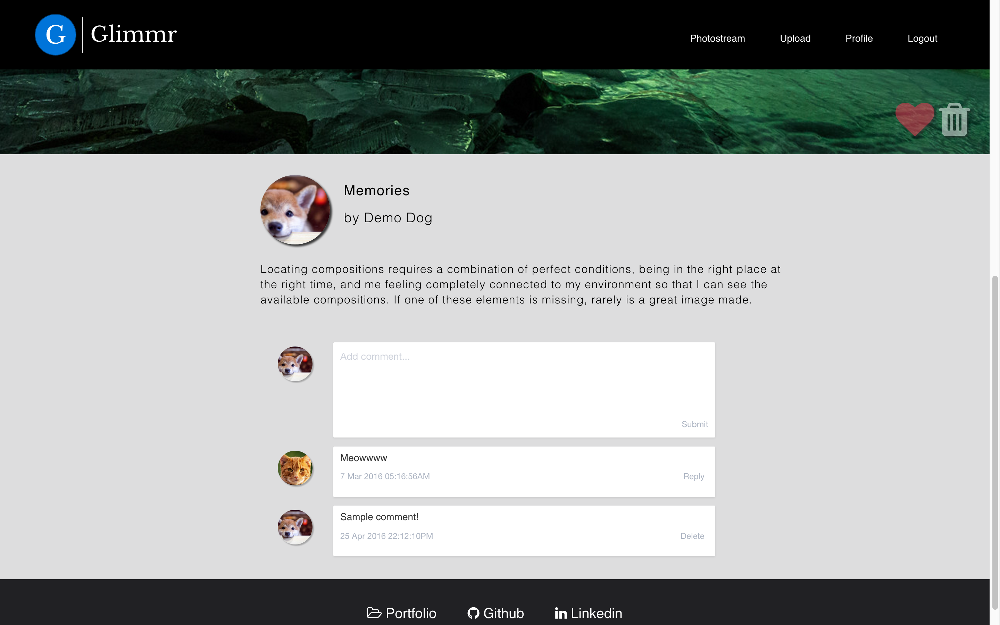

# Glimmr

### [Live Link](http://glimmr.herokuapp.com/)

Glimmr is an image hosting website that allows users to upload pictures of any kind and share them with other Glimmr users. Glimmr was designed with user experience in mind, with the user interface and page responsiveness being two key points of emphasis during development. It is inspired by [Flickr](https://www.flickr.com/).

## Overview

Glimmr is a full-stack web application built from ground up by [Joshua Hwang](https://github.com/joshhwang1125). Glimmr was built using PostgresSLQ, Rails, and React. The site uses the principles of Flux application architecture to achieve unidirectional data flow, which results in ease of debugging and simplification of data flow. Glimmr is built as a single-page app, which provides a fluid and responsive user experience. The user interface is built with custom CSS, resulting in a unique design. A JSON API is used to make efficient database queries, fetching specific data only when necessary.

## Features

### Splash

Glimmr possesses a static splash page, which utilizes hand-rolled CSS and jQuery to create a welcoming page that captivates the user's attention.

### Login

Glimmr uses an back end authentication system. Password hashing is accomplished using BCrypt.

### Photostream

The photostream serves as the main landing page after creating an account or logging in. Photos fade in and out on hover, and can be favorited and viewed. The grid system is built using Flexbox, allowing for dynamic resizing. Photos are sorted based on time of upload.

### Upload

Glimmr utilizes the Cloudinary API to upload and store images. After uploading an image, the URL for the image is parsed and stored in the database, allowing the image to be fetched at a later date in time.

### Profile

The profile page is the hub page for each user. Here, users can view their profile summary, their uploaded photos, their favorited photos, and other users that they are following.

### Photo View

When clicking on a photo, the user is brought to the photoview page. Here, they can click the arrow buttons to go to the previous or next photo. They can also favorite photos, and delete them if they are the original uploader. At the bottom of the page, there is a comment section, where the comments are displayed with the commenter's profile picture.

## Future Features

1. Create the ability to tag photos.
2. Add the ability to tag photos by location.
3. Add a search bar to search photos by users and tags.

